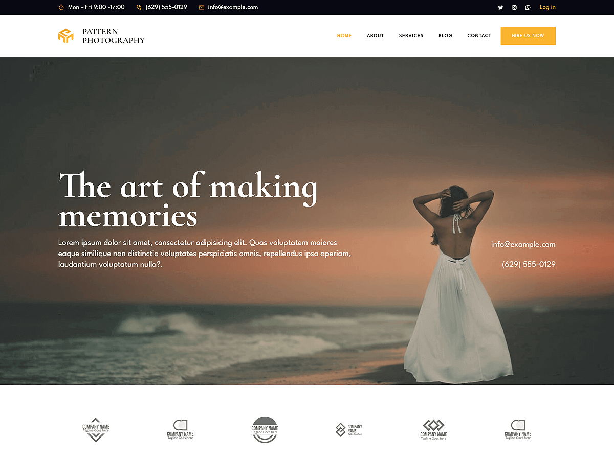

# Patterns Photography

Patterns Photography is a sleek and sophisticated WordPress theme designed for photographers, photo studios, and creative professionals. Built with WordPress Full Site Editing (FSE), this theme offers effortless customization of headers, footers, templates, and global styles directly within the WordPress Site Editor.It includes pre-designed patterns and layouts tailored for showcasing portfolios, photography services, client testimonials, and contact information. The theme also features layouts for gallery displays, about pages, pricing, blogs, and more.With a responsive design, Patterns Photography ensures your website looks visually stunning and professional on all devices, offering an ideal platform to present your work and connect with potential clients.

Primary color: `#FBB42F`.



## Features

- 3 hero and landing patterns
- 5 card layouts (card-1 through card-5)
- 1 service section pattern
- 5 archive/post-listing patterns
- Contact page pattern (page-contact)
- 1 menu navigation pattern
- 13 section layout patterns (featured sections and section titles)
- Full Site Editing (FSE) support
- Responsive design
- 65 block patterns + 15 templates + 11 template parts
- Photography-oriented layouts (galleries, portfolios, contact)

## Requirements

- WordPress 6.6 or higher
- PHP 7.0 or higher
- Tested up to WordPress 6.7

## Development

This theme uses `@wordpress/scripts`:

```sh
npm install
npm run start    # dev mode with watch
npm run build    # production build
```

## License

GNU General Public License v2 or later.

This theme is based on [WP Block Theme Boilerplate](https://github.com/codersantosh/wp-block-theme-boilerplate), (C) 2025 Santosh Kunwar, [GPLv2 or later](https://www.gnu.org/licenses/gpl-2.0.html).
